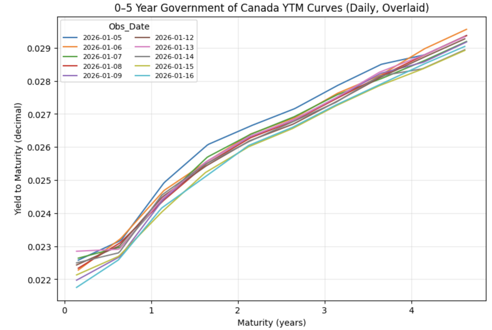
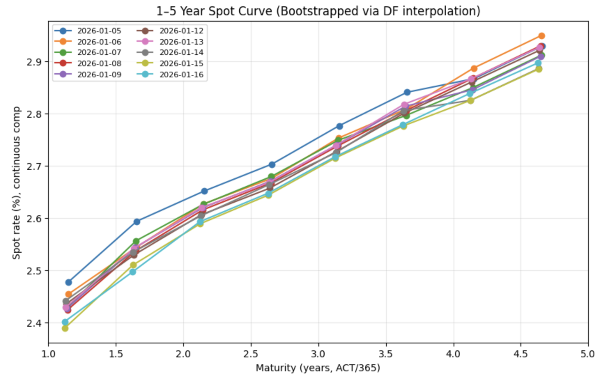

# Government of Canada Fixed Income Term Structure Analysis

Python-based fixed income analysis of the 0–5 year Government of Canada term structure.

This project was completed as part of **APM466: Mathematical Theory of Finance** at the University of Toronto.

## Overview

The project constructs and analyzes the short-to-medium-term Government of Canada yield curve using 10 sovereign bonds with staggered maturities.

The analysis includes:

- Construction of 0–5Y yield-to-maturity curves
- Bootstrapping of discount factors and spot rates from coupon bond prices
- Log-linear interpolation of discount factors
- Derivation of 1-year forward rates
- Covariance analysis of yield and forward-rate changes
- Principal component analysis (PCA) of cross-maturity movements

## Methodology

### 1. Yield Curve Construction

Government of Canada bonds with maturities approximately six months apart were used to construct daily yield curves across the 0–5 year maturity range.



### 2. Spot Rate Bootstrapping

Discount factors were bootstrapped sequentially from observed bond prices and semiannual coupon cash flows.

Log-linear interpolation of discount factors was used between observed maturity nodes, and continuously compounded spot rates were obtained from the resulting discount curve.



### 3. Forward Rates

One-year forward rates were derived from the bootstrapped discount factors across the 1–5 year term structure.

### 4. Covariance and PCA

Daily changes in yields and forward rates were used to construct covariance matrices across maturities.

Principal component analysis was then applied to examine common patterns of movement across the term structure.

## Tools

- Python
- pandas
- NumPy
- Matplotlib
- Jupyter Notebook

## Repository Structure

```text
.
├── APM466_A1.ipynb
├── APM466_A1_LH.pdf
├── Bond_Data_MT_long.xlsx
├── Bond_Data_ST_long.xlsx
├── pngs/
│   ├── yield_curve.png
│   ├── spot_curve.png
│   └── forward_curve.png
└── README.md
